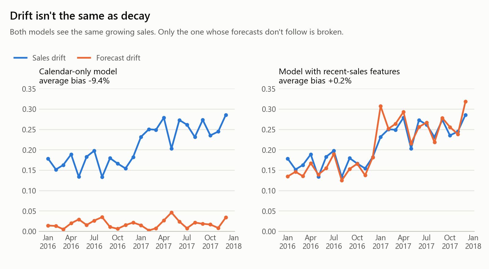
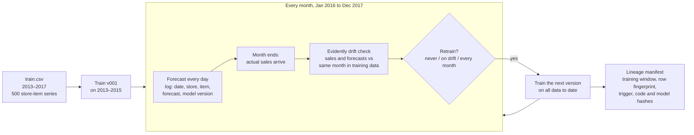
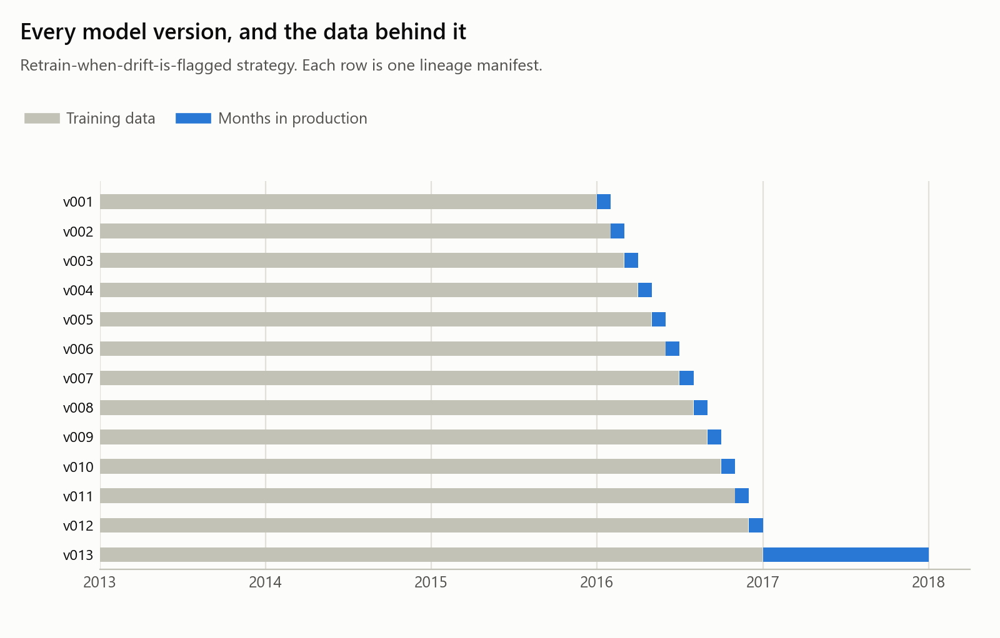

# Demand Drift Monitor

[](https://github.com/Sayma-Sf/demand-drift-monitor/actions/workflows/ci.yml)


[](https://demand-drift-monitor.streamlit.app)

**A demand forecast left running for two years, and the monitor that catches it going stale.**
An XGBoost model trained on 2013–2015 sales forecasts 500 store-item series month by month through
2016 and 2017. Every month an [Evidently](https://github.com/evidentlyai/evidently) drift check
compares the month with the model's training data. Every model version writes a lineage manifest,
so any forecast can be traced to the exact rows it was trained on.

**Live demo: [demand-drift-monitor.streamlit.app](https://demand-drift-monitor.streamlit.app)**.
Switch between retraining strategies, compare the naive and seasonal drift checks, and trace any
forecast from the two production years to the model version and training data behind it. (On the
free tier the app sleeps when idle; if you see "get this app back up", it wakes in under a minute.)

<picture>
  <source media="(prefers-color-scheme: dark)" srcset="reports/figures/drift_timeline_dark.png">
  
</picture>

## Key findings

- **The model went stale without anyone noticing.** Trained once on store, item and calendar
  features, it under-forecast by **7.7% through 2016 and 11.2% through 2017**, because sales kept
  growing. Its error rate (SMAPE 13.8%, then 15.4%) would not have looked alarming on its own.
- **Its forecasts never drifted; sales drifted every month.** Against the same month in its training
  data, sales drift was flagged in 24 of 24 months and forecast drift in 0 of 24. That gap is the
  staleness signature: the world moved and the model didn't.
- **A naive drift check is useless here.** Comparing each month with the whole training window
  flagged all 24 months for every strategy, including the healthy ones. The score swung from 0.11 to
  1.02 with the seasons. Comparing July with July left a steady signal of real growth (0.13 to 0.20
  in 2016).
- **Retraining when drift is flagged got nearly all the benefit of retraining every month with about
  half the models.** SMAPE 12.76% vs 12.71%, bias −3.5% vs −2.6%, from 13 model versions instead of
  24. Never retraining: SMAPE 14.63%, bias −9.4%.
- **The threshold is a business decision, not a default.** In 2017 growth slowed to about 4% a year.
  Drift scores (0.05 to 0.10) stayed just under Evidently's default threshold of 0.1, so the
  drift-triggered model wasn't retrained all year, and its bias settled at −3.8% against −1.9% for
  monthly retraining. A 0.05 threshold would have caught it.
- **Drift isn't the same as decay.** A second model that also sees recent sales went through exactly
  the same growth. Its sales and its forecasts both drifted in all 24 months, yet its bias stayed at
  **+0.2% with no retraining at all**.
- **Every forecast is traceable.** All 38 model versions across the three strategies have a manifest.
  The forecast for store 3, item 17 on 14 March 2017 traces to v013, trained on 730,500 rows from
  2013-01-01 to 2016-12-31, and the fingerprint recomputed from the raw file matches.

## What data drift is, and why an unattended model needs a monitor

A model learns from a snapshot of the past. **Data drift** is when the data it sees in production
stops looking like that snapshot: customers change, prices move, a business grows. The model
doesn't notice. It keeps producing forecasts with the same confidence, and the first sign of
trouble usually shows up somewhere else: empty shelves, cash tied up in the wrong stock.

A drift monitor measures the change instead of waiting for it to cause damage. Two design choices
decide whether it helps or just makes noise:

1. **What "normal" looks like.** Sales here are strongly seasonal (July runs 28% above the yearly
   average, January 32% below), so July always looks different from a whole-year average. A monitor
   that compares July with the entire training window raises an alarm every summer and every
   winter. This project compares each month with **the same calendar month** in the model's most
   recent training year, which leaves only real change.
2. **What counts as a problem.** Drift in the target or the inputs isn't automatically a broken
   model. The warning sign is **sales drifting while forecasts don't follow**.

<picture>
  <source media="(prefers-color-scheme: dark)" srcset="reports/figures/drift_is_not_decay_dark.png">
  
</picture>

## How it works



- **The forecast.** XGBoost on store, item, day of week, month, day of year and year. It can forecast
  any future date from the calendar alone, which is why planning teams like models like it, and why
  it can't see growth that happened after training.
- **The drift test.** Evidently's `ValueDrift` with the normalised Wasserstein distance (the
  Wasserstein distance divided by the reference's standard deviation) on daily sales and on
  forecasts, flagged at 0.1.
- **The strategies.** All three replay exactly the same 24 months from the same starting model:

| Strategy | Retrains after a month when | Model versions | SMAPE | Bias 2016 | Bias 2017 |
|---|---|---|---|---|---|
| Never retrain | never | 1 | 14.63% | −7.7% | −11.2% |
| **Retrain when drift is flagged** | its sales drifted from the same month in the training data | **13** | **12.76%** | −3.3% | −3.8% |
| Retrain every month | always | 24 | 12.71% | −3.3% | −1.9% |
| _Comparison: model with recent-sales features, never retrained_ | never | 1 | 12.12% | −0.3% | +0.7% |

SMAPE and bias are averaged over the 24 months. Bias compares total forecast with total actual sales
each month, so −8% means ordering 8% too little. Per-month numbers are in
[`results/monthly.csv`](results/monthly.csv).

## Lineage: an artifact, not a claim

"Trained on data up to January 2016" is only useful if someone can check it. Every model version
writes a manifest to [`artifacts/lineage/`](artifacts/lineage) when it is trained. This is the real
one for the first drift-triggered retrain, trimmed:

```json
{
  "model_version": "v002",
  "strategy": "drift_triggered",
  "trigger": {"type": "drift", "month": "2016-01", "column": "sales", "method": "wasserstein",
              "score": 0.1788, "threshold": 0.1, "reference_month": "2015-01"},
  "training_data": {
    "source_file": "data/train.csv",
    "source_sha256": "038f25690a65149c94f86ddd3deceda20c037a5cfd754cafdfc539a72992f2ed",
    "date_from": "2013-01-01", "date_to": "2016-01-31", "rows": 563000, "series": 500,
    "snapshot_sha256": "a5732d8cc580b4b7ce4bd0d2bebb5ff3a602f085cd214ad1365966eb6d22642a",
    "snapshot_definition": "sha256 of int64 [days since epoch, store, item, sales] rows sorted by date, store, item"
  },
  "model": {"type": "xgboost.XGBRegressor",
            "features": ["store", "item", "dayofweek", "month", "dayofyear", "year"],
            "file": "artifacts/models/drift_triggered/v002.ubj",
            "file_sha256": "653d9dbce2648ed55f73d8ba36c2d36bdb475d861bb5aee2c5d17cb50cbb11b8"},
  "code_sha256": "c071aa8d79ff584867a917b99c31b90135a4135dbe3807507d8825999407cc03",
  "library_versions": {"xgboost": "3.2.0", "evidently": "0.7.23", "pandas": "2.3.3", "numpy": "2.2.6"},
  "served": {"from": "2016-02-01", "to": "2016-02-29"}
}
```

Every logged forecast records the version that made it, so tracing a number back is one command:

```text
$ python -m src.lineage.trace --date 2017-03-14 --store 3 --item 17
Forecast for 2017-03-14 (drift_triggered) was made by v013
  why it exists:   {"type": "drift", "month": "2016-12", "column": "sales", "method": "wasserstein", "score": 0.1823, "threshold": 0.1, "reference_month": "2015-12"}
  trained on:      2013-01-01 to 2016-12-31, 730,500 rows
  snapshot sha256: 8e34a0fd7ac9026d7c04975197f34dd62f1abe728e8c425fbf57c56937fc34f7
  model file:      artifacts/models/drift_triggered/v013.ubj (beb70e237d04a0f7...)
  logged forecast: 34.4 units by v013
  VERIFIED: recomputed snapshot 8e34a0fd7ac9026d... from 730,500 rows
```

The last line recomputes the training-snapshot fingerprint from `data/train.csv`. If a single sales
figure in that window had changed since training, it would say MISMATCH, and a test changes one value
on purpose to check exactly that. The fingerprint uses a fixed canonical form rather than the CSV
bytes, so it survives the file being re-saved or re-sorted. `code_sha256` covers only the code that
decides what a model is (loading, features, training, monitoring, retraining), so every manifest here
matches the committed source.

<picture>
  <source media="(prefers-color-scheme: dark)" srcset="reports/figures/lineage_timeline_dark.png">
  
</picture>

## Limitations

- **A replay, not live production.** Actual sales arrive the moment a month ends, with no late or
  corrected data, and nothing breaks in the pipeline itself.
- **Very regular data.** The competition data has almost perfectly clean seasonality and steady growth.
  Real demand has promotions, stock-outs and new products, which make drift harder to separate from
  noise.
- **Aggregate checks.** Drift is measured on all 500 series together. A shift in one store's mix
  could hide inside a stable total. Per-store or per-item checks are the natural next step.
- **An untuned threshold.** Evidently's default of 0.1 was kept on purpose to show what a default does.
  In practice it should come from how much bias the business can tolerate.
- **A deliberately limited model.** The calendar-only forecast was chosen because it goes stale.
  With recent sales as features, the comparison model is better on this data and needed no retraining.
- **Fingerprints, not a data version-control system.** The competition rules don't allow
  redistributing the data, so it isn't versioned in git. The manifests record the source file's
  SHA-256, so verification needs that same file. Model files (300 MB) and the prediction log are
  rebuilt by the pipeline rather than committed.

## Run it yourself

Python 3.11. From Git Bash on Windows (on macOS/Linux use `venv/bin/activate`):

```bash
python -m venv venv
source venv/Scripts/activate
python -m pip install -r requirements-pipeline.txt
python -m kaggle auth login     # once per machine, then accept the competition rules on Kaggle
python data/download.py
python -m src.pipeline          # full replay, about 16 minutes on an 8-core laptop
python -m src.lineage.trace --date 2017-03-14 --store 3 --item 17
python -m pytest                # 23 tests on synthetic sales, no Kaggle data needed
ruff check .
python -m streamlit run app.py
```

`python -m src.pipeline --quick` replays four months with small models in about a minute.

> **Windows note.** Compiled packages are pinned to widely used releases because Windows Smart App
> Control blocks brand-new native wheels.

## Repository layout

```
demand-drift-monitor/
├── app.py                     # Streamlit dashboard (reads results/ and artifacts/lineage/)
├── artifacts/lineage/         # one JSON manifest per model version, per strategy (committed)
├── data/download.py           # Kaggle competition download with row checks
├── notebooks/                 # exploratory look at growth and seasonality
├── reports/figures/           # README charts, light and dark
├── results/                   # monthly.csv, summary.json
├── src/
│   ├── config.py              # timeline, strategies, drift threshold, XGBoost settings
│   ├── ingest/load.py         # schema and completeness checks, month helpers
│   ├── features/calendar.py   # calendar features; recent-sales features for the comparison
│   ├── models/forecaster.py   # train, save, SMAPE / MAE / bias
│   ├── monitoring/drift.py    # Evidently ValueDrift, seasonal and naive references
│   ├── lineage/               # manifests, fingerprints, trace command
│   ├── simulation.py          # the month-by-month production replay
│   ├── reporting/             # figures and dashboard data helpers
│   └── pipeline.py            # runs every strategy and writes results
├── tests/
├── requirements.txt           # dashboard runtime only (what Streamlit Cloud installs)
└── requirements-pipeline.txt  # full stack for the replay and tests
```

## Deploy the demo

1. On [share.streamlit.io](https://share.streamlit.io), click **Create app**, then **Yup, I have an app**.
2. Repository `Sayma-Sf/demand-drift-monitor`, branch `main`, main file `app.py`.
3. Under **Advanced settings**, choose Python 3.11. Streamlit installs `requirements.txt` only.

## Data and references

- Data: [Store Item Demand Forecasting Challenge](https://www.kaggle.com/competitions/demand-forecasting-kernels-only),
  five years of daily sales for 10 stores and 50 items. Competition data: downloaded after accepting
  the rules, never redistributed.
- [Evidently](https://github.com/evidentlyai/evidently), open-source ML monitoring (version 0.7.23).
- T. Chen and C. Guestrin, *XGBoost: A Scalable Tree Boosting System*, KDD, 2016.
- J. Gama, I. Žliobaitė, A. Bifet, M. Pechenizkiy and A. Bouchachia, *A Survey on Concept Drift
  Adaptation*, ACM Computing Surveys 46(4), 2014.

## License

MIT, see [LICENSE](LICENSE). The competition data keeps its own terms on Kaggle.
